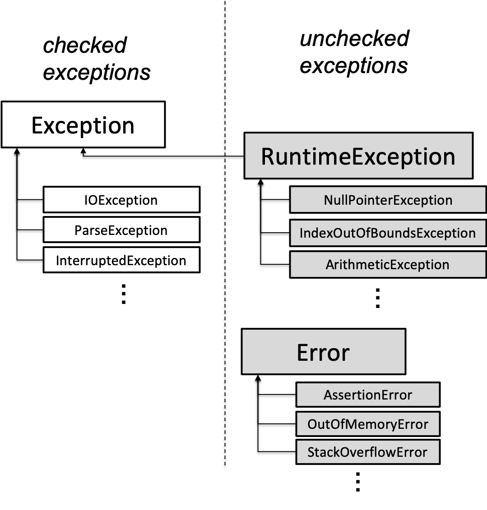
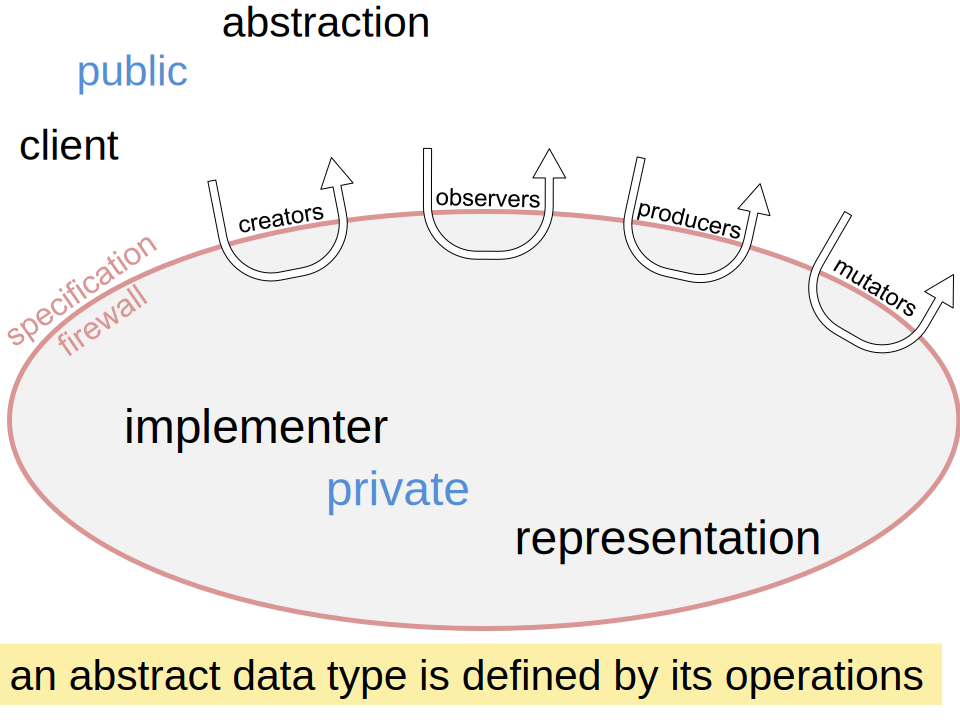

# Overall Refelection

这门课介绍和练习了软件工程的三个基本原则：避免漏洞（safe from bugs），易于理解（easy to understand），和易于调整（ready for change）。

- 避免漏洞：在于正确性和防御机制（未来的正确性） 
	Correct today and correct in the unknown future.
- 易于理解：给未来的读者（很可能是自己）提供方便 
	Communicating clearly with future programmers, including future you.
- 易于调整：不同的程序设计导致调整时重写量的很大差别 
	Designed to accommodate change without rewriting.

这门课的每一个主题最后都会回到对于这三个基本原则的讨论，从中学到的最主要的知识也都是针对这三个原则的实践：

- 记录（Documentation）/契约（Contract）/开发（Development）
	- 设计说明（Specification）
		- AF，RI，& Rep exposure
	- 测试优先（Test-first programming）
	- 版本控制（Version control）
	- 避免调试（Avoiding Debugging）
		- 断言 Assertion，模块化 Modularity，封装 Encapsulation
- 数据类型（Data Type）
	- 不可变性（Immutability）
	- 静态类型检查（Static typing/Static type checking）
	- 相等（Equality）
- 抽象数据类型（Abstract Data Type）
	- 接口（Interface）
	- 枚举（Enum）
	- 递归数据类型（Recursive Data Types）
- 并发（Concurrency）
	- 同步（Synchronization）
	- 消息传递（Message Passing）
- 模式（Pattern）
	- 语法分析（Parsing）
	- 第一类函数（First-class Function）（in java……）
		- 回调函数（Callbacks）
		- 流处理：映射，过滤，归纳（Map，Filter，Reduce）
		- 访问者模式（Visitor Pattern）

而几个Problem Set也针对这些问题进行了练习

- Lab1. warmup：熟悉Java，IDE和Git
- Lab2. tweettweet：设计说明和测试优先
- Lab3. the librarians：抽象数据类型，AF，RI，& Rep exposure（immutability）
- Lab4. expressivo：语法分析
- Lab5. multiplayer minesweeper：同步
- Project. abc music player：大综合

### Hacking vs. Engineering

无约束的乐观：

- 写大量代码过程中不做任何测试
- 把所有细节都记在脑子里，假设会永远记住它们，而不是写在代码中（documentation）
- 假设漏洞不存在或者很容易找到和修复

工程师的悲观：

- 一次写一点代码，边写边测试
- 记录代码所依赖的假设
- 保护你的代码远离自己犯的错，静态检查会起到作用

# **Review**

## Design / Documentation / Development

### 测试

- 分区 Patition：选择测试实例
	- 包含边界条件
	- Documentation：记录测试策略，主要是partition策略
- 测试术语
	- 黑盒/白盒（玻璃盒）测试：只针对spec/也针对implementation
		- 白盒测试同样要遵循spec的要求，不能弱于或强于spec
	- 覆盖率 Coverage
	- 单元/集成测试 Unit/Integration Testing：都是必要的
	- 自动回归测试 Automated Regression Testing：每次调整代码后运行所有测试
- 迭代测试优先程序设计 Iterative Test-First Programming
	- 过程
		1. 编写函数的设计说明spec
		2. 针对spec写测试test。发现问题时，迭代spec和test
			- spec可能出错，不完整，含混，缺少边角案例，写测试有助于发现这些问题，防止在错误的spec上编写函数的实现
		3. 编写函数的实现implementation。发现问题时，迭代spec，test和implementation
	- 迭代：***<u>由于多次迭代的可能，一次花大量时间把一个步骤完善是不理智的</u>***
		- 对于大型spec，首先写一部分，然后测试和实现该部分，再进行迭代
		- 对于复杂的test suite，选择几个重要的分区，创建小型的test suite，然后编写通过这些test的实现，再进行迭代有更完善分区的test suite
		- 对于困难的实现，先编写一个穷举（brute-force）的实现来检验spec和test，然后再迭代更困难更好的实现方式
	- 迭代是所有现代软件工程过程的一个特征，如 [Agile](https://en.wikipedia.org/wiki/Agile_software_development) 和 [Scrum](https://en.wikipedia.org/wiki/Scrum_(software_development))
- [Testing an abstract data type](http://web.mit.edu/6.031/www/sp21/classes/10-abstract-data-types/#testing_an_abstract_data_type)
- [Testing client/server code](http://web.mit.edu/6.031/www/sp21/classes/24-sockets-networking/#testing_clientserver_code)

### 代码Review

- Process
	- [Google’s code review process](https://google.github.io/eng-practices/review/)
	- [Code Reviewing document](http://web.mit.edu/6.031/www/sp21/general/code-review.html) on the course website.

- 风格标准
	- [Google Java Style](http://google.github.io/styleguide/javaguide.html) 
	- DRY
	- 注释（需要的地方）
	- Fail-fast
	- 避免magic numbers（可以使用ENUM，map等）
	- 每个变量一个目的
	- 命名
		- 大小写：classes typically start with a capital letter, and variable names and method names start with a lowercase letter
			- `ALL_CAPS_WITH_UNDERSCORES` is used for `static final` constants. But the local variables declared inside a method, including local constants like `secondsPerDay`, use camelCaseNames.
		- 动名词：method names are usually verb phrases, like `getDate` or `isUpperCase`, while variable and class names are usually noun phrases
		- 避免缩写：choose short words, and be concise, but avoid abbreviations
	- 不要使用全局变量（可改变的，可以从程序任意位置访问的名称）
	- 方法应返回结果而不是打印结果
	- 避免处理特例的代码（如果主体部分可以处理该特例）

### 版本控制

### 设计说明（技术标准） Specification

- 结构
	- 方法签名 method signature，包含名称，参数类型，返回类型，exceptions thrown
	- *require* 语句，描述对于参数的附加要求
	- *effects* 语句，描述返回值，exception和方法的其他效果
- default
	- 默认禁止 `null` 作为参数值和返回值
	- 默认允许空集合作为参数值和返回值
	- 默认禁止对参数的mutation
- 异常 Exception
	- 处理特殊结果
		- Java Library经常使用类似 -`1` 和 `null` 这样的结果，但容易导致bug（如忘记处理）
		- 使用Exception可以让compiler帮助检查（static checking）
			- 方法抛出一个检查性异常
			- 调用者（caller）通过 `catch` 处理异常
	- Checked/Unchecked Exceptions
		-  
		- Checked
			- 特殊结果信号
			- 如果一个方法可能抛出一个检查性异常，在方法签名中必须说明
			- 如果一个方法调用了一个可能抛出检查性异常的方法，它必须处理这个异常或者在方法签名中说明
		- Unchecked
			- 漏洞信号
			- 我们不希望在调用链上的每个函数去处理这些发生在低层级调用上的异常：索引越界，null值，非法参数，assertion失败等

- 设计
	- 强弱适度
	- 前置条件和后置条件的工程选择（考虑scope）
		- private可以使用前置
		- 库方法通常后置
	- 没有特殊要求时，尽可能使用抽象类型（ArrayList vs. List）

### 避免调试

- 让错误难以出现
	- static checking，dynamic checking，immutability
- 缩小错误范围
	- 防御式程序设计 Assertions
		- argument / return value requirements
	- 渐进式开发 Incremental development
	- 模块化 Modularity
		- 分解为小型函数和小型类
	- 封装 Encapsulation
		- 围绕模块建立壁垒，使得程序其他部分的错误不影响模块的完善性
			- 访问控制 access control
			- 最小化变量作用域 variable scope：将变量声明放在最内部的block内；只在第一次需要的时候声明变量

### 调试 Debugging

- 10分钟法则
	- 如果花费超过10分种在临时的非系统的调试上，这就是开始使用科学方法的时候了
- 从头脑到纸笔/笔记，记录每个循环：
	- 你的下一个假设是什么
	- 什么样的实验可以证实这个假设
	- 你对实验的预测是什么
	- 实验的实际结果是什么
- 步骤
	1. 重现bug
	2. 找到bug的科学方法
		1. 研究数据（如stack trace）
		2. 假设：slicing，delta debugging
		3. 实验
			- 方法：`print`, `assert`, breakpoint with a debugger
			- 一次一个bug
			- 实验之前不要解决bug
		4. 重复1-3
	3. 解决bug
		- 代码问题还是设计问题
		- 取消实验中添加的内容：`print`, `assert`, breakpoint
		- 回归测试 regression test

### 使用ADT编写程序

- [步骤+实例](http://web.mit.edu/6.031/www/sp21/classes/19-programming-with-adts/)

### 其他Documentation

- 测试

	- 记录测试策略，主要是partition策略，如：

		```java
		public class Multiply {
		  /*
		   * Testing strategy
		   *
		   * cover the cartesian product of these partitions:
		   *   partition on a: positive, negative, 0
		   *   partition on b: positive, negative, 0
		   *   partition on a: 1, !=1
		   *   partition on b: 1, !=1
		   *   partition on a: small (fits in a long value), or large (doesn't fit)
		   *   partition on b: small, large
		   * 
		   * cover the subdomains of these partitions:
		   *   partition on signs of a and b:
		   *      both positive
		   *      both negative
		   *      different signs
		   *      one or both are 0
		   */
		  
		  // covers a is positive, b is negative, 
		  //        a fits in long value, b fits in long value,
		  //        a and b have different signs
		  @Test
		  public void testDifferentSigns() {
		      assertEquals(BigInteger.valueOf(-146), BigInteger.valueOf(73).multiply(BigInteger.valueOf(-2)));
		  }
		
		  // covers a = 1, b != 1, a and b have same sign
		  @Test
		  public void testIdentity() {
		      assertEquals(BigInteger.valueOf(33), BigInteger.valueOf(1).multiply(BigInteger.valueOf(33)));
		  }
		```

- 类

	- AF, RI, and safety from rep exposure，如：

		```java
		  // Rep invariant:
		  //   author is a Twitter username (a nonempty string of letters, digits, underscores)
		  //   text.length <= 280
		  // Abstraction function:
		  //   AF(author, text, timestamp) = a tweet posted by author, with content text, 
		  //                                 at time timestamp 
		  // Safety from rep exposure:
		  //   All fields are private;
		  //   author and text are Strings, so are guaranteed immutable;
		  //   timestamp is a mutable Date, so Tweet() constructor and getTimestamp() 
		  //        make defensive copies to avoid sharing the rep's Date object with clients.
		```

- 递归数据类型

	- comment in the interface：循环数据类型的定义，如：

		```java
		  // Datatype definition:
		  //   ImList<E> = Empty + Cons(elt:E, rest:ImList<E>)
		```

- [线程安全](http://web.mit.edu/6.031/www/sp21/classes/21-thread-safety/#how_to_make_a_safety_argument)

	- ```java
		  // Thread safety argument:
		  //    This class is threadsafe immutable:
		  //    - a, start, and len are final
		  //    - a points to a mutable char array, which may be shared with other
		  //      MyString objects, but they never mutate it
		  //    - the array is never exposed to a client
		
		  // Thread safety argument:
		  //    people is a threadsafe set, and the people variable is unreassignable.
		
		  // Thread safety argument:
		  //   all accesses to text happen within SimpleBuffer methods,
		  //   which are all guarded by SimpleBuffer's lock
		```

### 其他开发策略

- [渐进开发](http://web.mit.edu/6.031/www/sp21/classes/09-avoiding-debugging/#incremental_development)
- [Agile](https://en.wikipedia.org/wiki/Agile_software_development) 和 [Scrum](https://en.wikipedia.org/wiki/Scrum_(software_development))

## Data Type

### 静态检查

相对动态检查，可以在程序运行前发现大量的错误和漏洞

但是每个变量都需要类型定义，函数也需要定义返回值的类型

### 可变性和不可变性

- 使用可变类型主要是效率的考虑
- 别名带来了可变类型的风险（无意的mutation，由其在参数传递时更为implicit）
- 针对可变类型带来的风险的策略
	- 使用不可变类型的wrapper
	- 使用防御复制 defensive copying
- 常用不可变类型
	- [`List.of`](http://docs.oracle.com/en/java/javase/15/docs/api/java.base/java/util/List.html#of(E...)), [`Set.of`](http://docs.oracle.com/en/java/javase/15/docs/api/java.base/java/util/Set.html#of(E...)), and [`Map.of`](http://docs.oracle.com/en/java/javase/15/docs/api/java.base/java/util/Map.html#of(K,V))
	- [`Collections.unmodifiableList`](http://docs.oracle.com/en/java/javase/15/docs/api/java.base/java/util/Collections.html#unmodifiableList(java.util.List)), ect.
	- [`List.copyOf`](http://docs.oracle.com/en/java/javase/15/docs/api/java.base/java/util/List.html#copyOf(java.util.Collection)), etc.
	- [`Collections.emptyList`](http://docs.oracle.com/en/java/javase/15/docs/api/java.base/java/util/Collections.html#emptyList()), etc.
- 不可变参照 immutable reference （`final`）

### 递归

- 辅助函数 Helper Methods
	- 原spec无法递归时增设辅助函数而不是修改spec
	- 有些递归方法的spec需要初始条件，增设辅助函数可以避免使用者输入初始条件
- 相互递归 Mutual Recursion
	- 简化代码
	- 为使用者提供两个不同的入口
- 可重入代码 Reentrant Code
	- 完全由参数和本地变量保持本身的状态
	- 不使用静态变量（static）和全局变量
	- 不共享可变对象的别名
- 递归的空间消耗（stack size）
	- 放心使用：递归深度和输入大小的关系是对数的
	- 如果关系是线性的，则输入大小受stack size的限制

### 相等

- 引用相等`=`（reference eq）和对象相等`equals()`（object eq）
- observational eq vs. behavioral eq
- 不可变类型
	- 由于散列值相等也是 `Object` 类对于相等的要求，因此如果覆盖（override）`equals()`函数的话，也需要覆盖`hashCode()`函数
- 可变类型
	- java默认可变类型也可以作为HashSet和HashMap的key，因此建议继承Object的`equals()`和`hashCode()`函数，直接对比对象的内存地址 (behavioral eq)


## Abstract Data Type

### 抽象数据类型

- 操作类型

	- Creator
		- constructor `new ArrayList()` 
		- factory method (as a static method) `List.of()`
	- Producer
		- 需要一个或多个该类的实例作为输入 `Collections.unmodifiableList()`
	- Observer
		- `list.size()` `list.get()`
	- Mutator
		- `list.add()` `list.remove()` `list.addAll()` `Collections.sort()`
		- 返回值
			- 一般返回 `void` 或一个布尔值
			- 有时也返回对象本身，这样可以将多个操作链接起来

- 一个抽象数据类型是由它的操作定义的

	-  

- 设计抽象类型

	- 最好是少量简单的操作，它们可以有一些强大的组合方式。而不是很多复杂的操作
	- 类型可以是一般的（如`List`），或特定领域的（如`CardDeck`），但不要将两者混杂
	- 抽象类型应该是独立于特定表现/实现的

- 抽象类型的Java实现

  | ADT concept        | Ways to do it in Java                                  | Examples                                             |
  | :----------------- | :----------------------------------------------------- | :--------------------------------------------------- |
  | Abstract data type | Class<br/>Interface + class(es) 1<br/>Enum 2           | `String`<br/>`List` and `ArrayList`<br/>`DayOfWeek`  |
  | Creator operation  | Constructor<br/>Static (factory) method<br/>Constant 3 | `ArrayList()`<br/>`List.of()`<br/>`BigInteger.ZERO`  |
  | Observer operation | Instance method<br/>Static method                      | `List.get()`<br/>`Collections.max()`                 |
  | Producer operation | Instance method<br/>Static method                      | `String.trim()`<br/>`Collections.unmodifiableList()` |
  | Mutator operation  | Instance method<br/>Static method                      | `List.add()`<br/>`Collections.copy()`                |
  | Representation     | `private` fields                                       |                                                      |


### 抽象函数AF和表示不变量RI

- 术语
	- 抽象值（Abstract Value：A）
	- 表示值（Representation Value：R）
	- 抽象函数（Abstraction Function：AF）
		- AF : R → A
	- 表示不变量（Representation Invraiant：RI）（也是算法中影响复杂度的因素）
		- RI : R → boolean
- `checkRep()`
	- 检查 `null` 如果没有被隐式得（implicitly）检查
- 避免表示暴露 Safety from rep exposure
- 使用ADT invariants代替spec的前置条件
	- 如使用`SortedSet`类型代替rep中说明`Set`需要是有序的 sorted
- 如果符合以下条件，则一个不变量成立
	1. 由creator或producer确立
	2. mutator，observer和producer都保持其不变
	3. 没有表示暴露

### 通过接口，范型，枚举和函数定义ADT

- 接口 Interface

	- 不能有fields

- 子类型 Subtypes

	- 子类型是超类型的子集
		- 自类型的spec至少和超类型一样强

	1. 实现或扩展抽象类型
		- `class ArrayList<E> implements List<E> {...}` 数据结构实现抽象类型
		- `interface SortedSet<E> extends Set<E> {...}` 抽象类型扩展抽象类型
	2. 子类 Subclassing
		- `class SpottedTurtle extends Turtle { ... }` 继承所有实例方法、域

- 范型 Generic Types
	- 范型接口可以由范型实现也可以由非范型实现
	- `void`在范型中使用`Void`（V大写，`extends Object`）
- 枚举 Enumerations

### 递归数据类型

- 定义方式
	- 抽象类型 = 具体类型（域1：类型，域2：类型……）+ 具体类型（……）+ ……
		- 域（field）可以为零到多个
- 递归定义方法
- RI和rep exposure
	- 具体类型为package-private
	- specs中不讨论具体类型
- 声明类型和实际类型

## Concurrency

### 并发

- 两个模型
	- 共享存储 shared memory
	- 信息传递 message passing
- 进程 Process
	- 抽象为一个虚拟计算机，让程序认为拥有整个计算机
- 线程 Thread
	- 抽象为一个虚拟处理器，让程序认为拥有整个处理器
- interleaving和竞争条件（race condition）
	- 不同代码行之间的interleaving
	- 单一代码行转化为多行机器/汇编语言代码后的interleaving

### 线程安全

- 数据类型或方法是线程安全的，意味着

	- 当从多个线程使用时，它的行为是正确的，无论这些线程是如何执行的，并且不需要调用代码进行额外的协调。

- 策略1: 禁闭 confinement

	- 让可变引用和可变数据只可以被一个线程访问
	- 避免global variable

- 策略2: 不可变性

	- 线程安全的数据类型需要使用lock来保证它的[beneficent mutation](http://web.mit.edu/6.031/www/sp21/classes/11-abstraction-functions-rep-invariants/#beneficent_mutation)是线程安全的
	- 线程安全的不可变性
		- 没有mutator
		- 所有域都是 `private final` 
		- 没有rep exposure
		- rep中的可变对象没有mutation（包括beneficent mutation）

- 策略3: 使用线程安全的数据类型

	- [Wrapper Collections](http://docs.oracle.com/javase/tutorial/collections/implementations/wrapper.html) 
	- [Concurrent Collections](http://docs.oracle.com/javase/tutorial/essential/concurrency/collections.html) 

- 策略4: 同步 Synchronization

	- 锁 Locking

		- Java中的所有对象实例都有锁，如：

			```java
			Object lock = new Object();
			```

		- Java中使用锁进行同步

			```java
			synchronized (lock) {balance = balance + 1;}
			```

	- 管程/监视器模式 Monitor Pattern

	- 锁的规则

		- 所有共享的可变变量必须被锁保护，数据不在锁外被读写
		- 如果一个不变量（invariant）包含了多个共享的可变变量，则所有变量必须被*同一个*锁保护

	- 应对deadlock的策略

		- [lock ordering](http://web.mit.edu/6.031/www/sp21/classes/22-locks/#deadlock_solution_1_lock_ordering)
		- [coarse-grained locking](http://web.mit.edu/6.031/www/sp21/classes/22-locks/#deadlock_solution_2_coarse-grained_locking)

	- [实践中的并发策略](http://web.mit.edu/6.031/www/sp21/classes/22-locks/#concurrency_in_practice)

### 队列和消息传递

- 相比共享内存，消息传递更不易出错
	- 并发的模块之间只能通过消息进行互动，而不直接改变共享数据
	- 并发的模块之间只传递不可变数据，即消息
- [消息传递实例](http://web.mit.edu/6.031/www/sp21/classes/23-queues/#message_passing_example)


## Pattern

### 其他模式

- [Iterator pattern](http://web.mit.edu/6.031/www/sp21/classes/08-immutability/#iterating_over_arrays_and_lists)
- [Monitor pattern](http://web.mit.edu/6.031/www/sp21/classes/22-locks/#monitor_pattern)

### 正则表达式和[形式文法](https://en.wikipedia.org/wiki/Formal_grammar)

- 终结符 terminals，非终结符 nonterminals，操作符 operators

- 产生式 productions

	```parserlib
	nonterminal ::= expression of terminals, nonterminals, and operators 
	```

- 分析树 parse tree

- 正则表达式

	- 正则文法的特性：将所有非终结符替换后能够简化成一个单一的产生式
		- 因此production中如果有针对自身的递归则不是正则的（regular 规则的、规律的）
	- 正则表达式：使用单个字符串来描述、匹配一系列匹配某个句法规则的字符串

### 语法分析器 Parser

- [ParserLib](http://web.mit.edu/6.031/www/sp21/classes/18-parsers/)
	- 简单易用，但IntelliJ无法对*.g文件进行检查
- [Antlr](http://web.mit.edu/6.005/www/sp16/classes/18-parser-generators)
	- 可能稍复杂，但IntelliJ有支持*.g4文件的插件

### 回调 Callbacks

- 通过参数将函数传递到其他代码，允许底层代码调用在高层定义的子程序
- 匿名类 [Anonymous classes](http://web.mit.edu/6.031/www/sp21/classes/20-concurrency/#anonymous_classes)
	- Java method不是第一类对象，完成回调的方式是将方法通过匿名类传入调用函数
	- 进一步的，为了实现第一类函数，Java使用一个包含一个方法的对象（函数对象）来表示第一类函数
- Lambda作为函数对象
	- Java依然不支持第一类对象，因此
		- 将lambda作为参数的方法必须能推断该函数对象（functional object）的类型
		- 推断的类型必须是一个函数接口 functional interface
- 事件处理系统（event processing system）中的并发
	- 该类系统在创建listener时往往会创建一个新的线程
- [实现者视角的callback](http://web.mit.edu/6.031/www/sp21/classes/25-callbacks/#implementing_an_event_source)

### Map, Filter, Reduce

- 方法参照 Method references

	- Package [java.util.function](https://docs.oracle.com/en/java/javase/15/docs/api/java.base/java/util/function/package-summary.html)

		- [Function](https://docs.oracle.com/en/java/javase/15/docs/api/java.base/java/util/function/Function.html)<T,R> represents a function that accepts one argument and produces a result

			```java
			Function<Double,Double> mySquareRoot = Math::sqrt;
			```

		- [BiFunction](https://docs.oracle.com/en/java/javase/15/docs/api/java.base/java/util/function/BiFunction.html)<T,U,R> represents a function that accepts two arguments and produces a result

- ```java
	cameras.filter(camera -> camera.brand().equals("Nikon"))
	       .map(Camera::pixels)
	       .reduce(Math::max);
	```

- 并发

	- [`collection.parallelStream()`](http://docs.oracle.com/en/java/javase/15/docs/api/java.base/java/util/Collection.html#parallelStream())
	- `stream.parallel()`

### Building languages to solve problems

- domain-specific language (DSL)
	- Extrenal: independent of any general-purpose programming language
		- ParserLib grammars, and the language of problem set 4
	- Internal: embedded in a general-purpose programming language

### 访问者模式 Visitor pattern

- 对于递归抽象数据类型增加操作的模式
	- Interpreter pattern
		- 在接口类中作为实例方法声明操作，然后在所有具体类中实现该操作
		- 缺点：一个操作实现分布在所有具体类中
			- 难以理解和调试
			- 难以改变
	- Visitor pattern
		- 组成
			- 额外结构：ADT类中一个子接口类`Visitor<R>`，包含针对所有具体类的方法`on`的声明；以及一个`accept`方法，其参数类型为`Visitor<R>`，在所有具体类中实现
			- 实现操作：ADT类中一个实现`Visitor<R>`的子类作为真正的操作的类，包含针对所有具体类的方法`on`的实现
		- A visitor factory
			- 额外结构：ADT类中增加一个静态方法，其参数为针对所有具体类的函数对象，返回值为一个`Visitor<R>`对象，其中包含使用参数中函数对象的针对所有具体类的方法`on`的实现
			- 操作的实现：ADT类中增加一个静态方法，参数类型为该类，以及其他必要的参数，返回值为该类参数调用`accept(makeVisitor(lambdas))`，lambdas为针对所有具体类的lambda函数对象
		- 通过以上操作可以将抽象类的方法在具体类中的实现都在抽象类中编写和调试
		- Generic Type: 如果操作没有返回值，则返回值类型为[`Void`](https://docs.oracle.com/en/java/javase/15/docs/api/java.base/java/lang/Void.html)（大写V），方法`on`的实现返回`null`

- Interpreter Pattern易于增加vairants，Visitor Pattern易于增加operations


# **Big Three**

### Safe from bugs

- 静态检查在运行前就检查类型和一些其他错误
- 设计说明尽量使用可以static checking的内容：static typing和exception
- 不可变类型不会受别名的影响，不可变参照永远指向同一对象
- ADT应通过记录表示不变量和`checkRep()`来保护其不变量
- Interface确定了ADT的概念作为一组方法，使用Interface时，使用者接触不到实现类（implementation class）的其他方法甚至暴露的表示（exposed rep）。
- Enum通过static checking保证使用者只能使用这个有限的集
- 递归相比迭代更简洁，且通常使用不可变数据类型和不可变参照
- 形式文法和正则表达式比手写分析代码更少出错
- 并发很难调试，需要更精心的设计来避免bug
- 使用线程安全的四种策略来避免race condition，比逐避免可能的interleaving更少出错
- Visitor Pattern下针对Recursive ADT的操作更容易debug

### Easy to understand

- 静态类型语言显式地说明数据类型，帮助理解代码
- 记录下测试策略可以帮助理解测试实例的选择和测试组的完整性
- 设计说明比实现代码更易阅读
- 阅读不可变类型/参照不需查找所有代码确认哪里有改变
- ADT隐藏了具体的实现，使用者只需了解它支持的操作
- ADT的表示不变量RI和抽象方程AF解释了该类型的抽象值和表示值之间的关系
- Interface作为ADT的形式化，不包含域和实例方法的实现，更易阅读
- Enumeration通过对常量命名，比magical number更易理解
- 递归实现相比迭代更短小且更易理解（针对天然的递归问题和递归数据）
- 使用者阅读我们定义的类型的spec时会预期一个合适的相等操作
- 形式文法非常易读，而正则表达式有时则易读性稍差
- 预测并发代码的interleaving很困难，代码最好让阅读者不需要进行这方面的预测
- 使用线程安全的四种策略来避免race condition，比逐一介绍有哪些可能的interleaving要容易理解得多
- Visitor Pattern下针对Recursive ADT的操作更易理解

### Ready for change

- 正确的测试组基于spec，因此允许在spec的范围内调整实现
- 设计说明作为契约，具体实现可以改变
- 我们可以增强设计说明（弱化前置条件或强化后置条件）而不需担心影响别处的调用
- 程序需要调整时不需担心调用不可变类型/参照的代码收到影响
- ADT独立于具体的表现，其具体实现可以修改而不影响使用者（不考虑操作的复杂度）
- Enumeration相比`int`和`String`，很容易调整和修改（搜索或refactor）
- Visitor Pattern让增加针对Recursive ADT的操作变得简单


# Resource

### [Code Review / Style](http://web.mit.edu/6.031/www/sp21/classes/04-code-review/)

- [Google’s code review process](https://google.github.io/eng-practices/review/)
- [Code Reviewing document](http://web.mit.edu/6.031/www/sp21/general/code-review.html) on the course website.
- [Google Java Style](http://google.github.io/styleguide/javaguide.html) 

### [Debugging](http://web.mit.edu/6.031/www/sp21/classes/13-debugging/#reading_13_debugging)

- A good book about systematic debugging is [*Why Programs Fail*](http://www.whyprogramsfail.com/toc.php) by Andreas Zeller. Much of this reading is inspired by that book.
- Also related is [“How to Debug”](https://blog.regehr.org/archives/199) by John Regehr, a lecture from an embedded systems course, which is more low-level than 6.031 but with the same general principles for systematic debugging.
- Finally, [*Debugging: The Nine Indispensable Rules for Finding Even the Most Elusive Software and Hardware Problems*](https://mit-library.skillport.com/skillportfe/main.action?assetid=RW$8779:_ss_book:5171#summary/BOOKS/RW$8779:_ss_book:5171) by David Agans is a readable, eminently practical guide to debugging in a variety of technical situations, from software to hardware to cars to plumbing.


