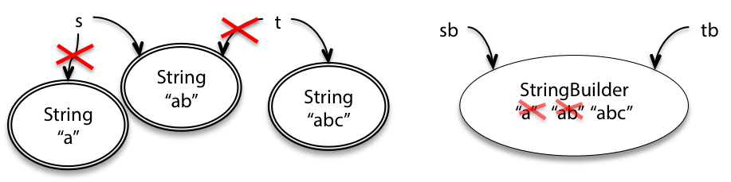
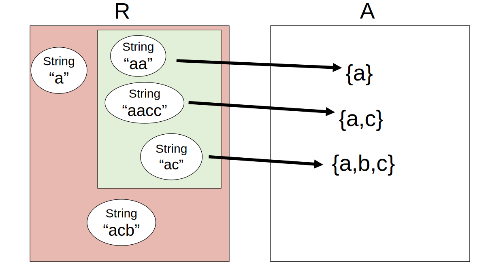

# <u>Reading 9: Mutability & Immutability</u>

## Mutability

[`String `](https://docs.oracle.com/javase/8/docs/api/?java/lang/String.html)is an example of an immutable type. A `String `object always represents the same string. [`StringBuilder `](https://docs.oracle.com/javase/8/docs/api/?java/lang/StringBuilder.html)is an example of a mutable type. It has methods to delete parts of the string, insert or replace characters, etc.

```java
String s = "a";
s = s.concat("b"); // s+="b" and s=s+"b" also mean the same thing
```

```java
StringBuilder sb = new StringBuilder("a");
sb.append("b");
```



### Why use Mutable object?

- A common use for it is to concatenate a large number of strings together.

	- Immutable: $O(n^2)$​ 

		- ```java
			String s = "";
			for (int i = 0; i < n; ++i) {
			    s = s + n;
			}
			```

	- Mutable: $O(n)$

		- ```java
			StringBuilder sb = new StringBuilder();
			for (int i = 0; i < n; ++i) {
			  sb.append(String.valueOf(i));
			}
			String s = sb.toString();
			```

- Another is convenient sharing: two parts of your program can communicate more conveniently by sharing a common mutable data structure.

## Risks of mutation

The answer is that **immutable types are safer from bugs, easier to understand, and more ready for change** . Mutability makes it harder to understand what your program is doing, and much harder to enforce contracts. 

### Risky example #1: passing mutable values

```java
/** @return the sum of the numbers in the list */
public static int sum(List<Integer> list) {
    int sum = 0;
    for (int x : list)
        sum += x;
    return sum;
}

/** @return the sum of the absolute values of the numbers in the list */
public static int sumAbsolute(List<Integer> list) {
  	// let's reuse sum(), because DRY, so first we take absolute values
    for (int i = 0; i < list.size(); ++i)
        list.set(i, Math.abs(list.get(i)));	// PROBLEM HERE!!!
    return sum(list);
}

// meanwhile, somewhere else in the code...
public static void main(String[] args) {
    List<Integer> myData = Arrays.asList(-5, -3, -2);
    System.out.println(sumAbsolute(myData));
    System.out.println(sum(myData));
}
```

### Risky example #2: returning mutable values

`Date `happens to be a mutable type.

```java
/** @return the first day of spring this year */
public static Date startOfSpring() {
    if (groundhogAnswer == null) groundhogAnswer = askGroundhog();
    return groundhogAnswer;
}
private static Date groundhogAnswer = null;

public static void partyPlanning() {
    // let's have a party one month after spring starts!
    Date partyDate = startOfSpring();
    partyDate.setMonth(partyDate.getMonth() + 1);	// PROBLEM HERE!!!
}
```

- **Solution1 Immutable DT**: In fact, you should never use `Date `! Use one of the classes from [package `java.time `](https://docs.oracle.com/javase/8/docs/api/index.html?java/time/package-summary.html): [`LocalDateTime `](https://docs.oracle.com/javase/8/docs/api/?java/time/LocalDateTime.html), [`Instant `](https://docs.oracle.com/javase/8/docs/api/?java/time/Instant.html), etc. All guarantee in their specifications that they are ***immutable*** .
- **Solution2 Defensive Copying**: `return new Date(groundhogAnswer.getTime());`
	- ut defensive copying forces `startOfSpring() `to do extra work and use extra space for *every client* — even if 99% of the clients never mutate the date it returns.
	- Immutability can be more efficient than mutability, because immutable types **never need to be defensively copied**.

### Aliasing is what makes mutable types risky

- Actually, **using mutable objects is just fine if you are using them entirely locally within a method, and with only one reference to the object**.
- What led to the problem in the two examples we just looked at was having multiple references, also called **aliases** , for the same mutable object.

### Specifications for mutating methods

**At this point it should be clear that when a method performs mutation, it is crucial to include that mutation in the method’s spec**

## Iterating over arrays and lists

```java
List<String> lst = ...;
for (String str : lst) {
    System.out.println(str);
}
```

is rewritten by the compiler into something like this:

```java
List<String> lst = ...;
Iterator iter = lst.iterator();
while (iter.hasNext()) {
    String str = iter.next();
    System.out.println(str);
}
```

### `MyIterator`

```java
/**
 * A MyIterator is a mutable object that iterates over
 * the elements of an ArrayList<String>, from first to last.
 * This is just an example to show how an iterator works.
 * In practice, you should use the ArrayList's own iterator
 * object, returned by its iterator() method.
 */
public class MyIterator {

    private final ArrayList<String> list;
    private int index;
    // list[index] is the next element that will be returned
    //   by next()
    // index == list.size() means no more elements to return

    /**
     * Make an iterator.
     * @param list list to iterate over
     */
    public MyIterator(ArrayList<String> list) {
        this.list = list;
        this.index = 0;
    }

    /**
     * Test whether the iterator has more elements to return.
     * @return true if next() will return another element,
     *         false if all elements have been returned
     */
    public boolean hasNext() {
        return index < list.size();
    }

    /**
     * Get the next element of the list.
     * Requires: hasNext() returns true.
     * Modifies: this iterator to advance it to the element 
     *           following the returned element.
     * @return next element of the list
     */
    public String next() {
        final String element = list.get(index);
        ++index;
        return element;
    }
}
```

- [**Instance variables** ](https://docs.oracle.com/javase/tutorial/java/javaOO/variables.html), also called fields in Java.
- A [**constructor** ](https://docs.oracle.com/javase/tutorial/java/javaOO/constructors.html), which makes a new object instance and initializes its instance variables.
- The `static `keyword is missing from `My­Iterator `’s methods, which means they are [**instance methods** ](https://docs.oracle.com/javase/tutorial/java/javaOO/methods.html)
- The [**`this `keyword** ](https://docs.oracle.com/javase/tutorial/java/javaOO/thiskey.html)is used at one point to refer to the **instance object** , in particular to refer to an instance variable ( `this.list `). This was done to disambiguate two different variables named `list `(an instance variable and a constructor parameter).
- **`private `**is used for the object’s internal state and internal helper methods, while `public `indicates methods and constructors that are intended for clients of the class
- **`final `**is used to indicate which of the object’s internal variables can be reassigned and which can’t.

### Desing Pattern

- The iterator concept allows a single uniform way to access them all, so that client code is simpler and the collection implementation can change without changing the client code that iterates over it.
- It’s an effective **design pattern** (a well-tested solution to a common design problem).

### Mutation undermines an iterator

```java
public static void dropCourse6(ArrayList<String> subjects) {
    MyIterator iter = new MyIterator(subjects);
    while (iter.hasNext()) {
        String subject = iter.next();
        if (subject.startsWith("6.")) {
            subjects.remove(subject);
        }
    }
}
```

- How can you fix this problem?

	- One way is to use the `remove() `method of `Iterator `, so that the iterator adjusts its index appropriately

	- ```java
		Iterator iter = subjects.iterator();
		while (iter.hasNext()) {
		    String subject = iter.next();
		    if (subject.startsWith("6.")) {
		        iter.remove();
		    }
		}
		```

## Mutation and contracts

### Mutable objects can make simple contracts very complex

- Java collections classes, which are normally documented with very clear contracts on the client and implementer of a class
	- you can’t modify a collection while you’re iterating over it.

### Mutable objects reduce changeability

- Mutable objects make the contracts between clients and implementers more complicated, and reduce the freedom of the client and implementer to change.

## Useful immutable types

- The primitive types and primitive wrappers are all immutable. If you need to compute with large numbers, [`BigInteger `](https://docs.oracle.com/javase/8/docs/api/?java/math/BigInteger.html)and [`BigDecimal `](https://docs.oracle.com/javase/8/docs/api/?java/math/BigDecimal.html)are immutable.
- Don’t use mutable `Date `s, use the appropriate immutable type from [`java.time `](https://docs.oracle.com/javase/8/docs/api/index.html?java/time/package-summary.html)based on the granularity of timekeeping you need.
- The usual implementations of Java’s collections types — `List `, `Set `, `Map `— are all mutable: `ArrayList `, `HashMap `, etc. The [`Collections `](https://docs.oracle.com/javase/8/docs/api/?java/util/Collections.html)utility class has methods for obtaining *unmodifiable views* of these mutable collections:
	- `Collections.unmodifiableList`
	- `Collections.unmodifiableSet`
	- `Collections.unmodifiableMap`
	- You can think of the unmodifiable view as a wrapper around the underlying list/set/map. A client who has a reference to the wrapper and tries to perform mutations — `add `, `remove `, `put `, etc. — will trigger an [`Unsupported­Operation­Exception `](https://docs.oracle.com/javase/8/docs/api/?java/lang/UnsupportedOperationException.html).
		- Before we pass a mutable collection to another part of our program, we can wrap it in an unmodifiable wrapper. We should be careful at that point to forget our reference to the mutable collection, lest we accidentally mutate it.
	- `Collections `also provides methods for obtaining immutable empty collections: `Collections.emptyList `, etc. Nothing’s worse than discovering your *definitely very empty* list is suddenly *definitely not empty* !

## Summary

In this reading, we saw that mutability is useful for performance and convenience, but it also creates risks of bugs by requiring the code that uses the objects to be well-behaved on a global level, greatly complicating the reasoning and testing we have to do to be confident in its correctness.

The key design principle here is **immutability** : using immutable objects and immutable references as much as possible. Let’s review how immutability helps with the main goals of this course:

- **Safe from bugs** . Immutable objects aren’t susceptible to bugs caused by aliasing. Immutable references always point to the same object.
- **Easy to understand** . Because an immutable object or reference always means the same thing, it’s simpler for a reader of the code to reason about — they don’t have to trace through all the code to find all the places where the object or reference might be changed, because it can’t be changed.
- **Ready for change** . If an object or reference can’t be changed at runtime, then code that depends on that object or reference won’t have to be revised when the program changes.

## *Thinking*

这一讲详细地讨论了Mutability（可变性）。

- 可变对象
	- 主要功能是在迭代修改时可以降低渐进复杂度，而且有时方便使用。
	- 如果是局部变量（不作参数），而且没有别名，可以放心使用。
		- 别名（aliasing）是可变对象最大的危险
	- 作为参数或返回值时很容易引起bug
		- 有些可变对象在返回时可以调整为不可变的wrapper type
- 不可变对象
	- 不可变对象使得使用者和实现者这件的契约变得更简单，两边的可变度也更高
	- 尽可能地使用
- 迭代器（iterator），作为一种设计模式（design pattern）

# <u>Reading 10: Abstract Data Types</u>

- **This idea enables us to separate how we use a data structure in a program from the particular form of the data structure itself.**
- **Abstract data types address a particularly dangerous problem: clients making assumptions about the type’s internal representation.**
- **The key idea of data abstraction is that a type is characterized by the operations you can perform on it.**

## What abstraction means

- **Abstraction.** Omitting or hiding low-level details with a simpler, higher-level idea.
- **Modularity.** Dividing a system into components or modules, each of which can be designed, implemented, tested, reasoned about, and reused separately from the rest of the system.
- **Encapsulation.** Building a wall around a module so that the module is responsible for its own internal behavior, and bugs in other parts of the system can’t damage its integrity.
- **Information hiding.** Hiding details of a module’s implementation from the rest of the system, so that those details can be changed later without changing the rest of the system.
- **Separation of concerns.** Making a feature (or “concern”) the responsibility of a single module, rather than spreading it across multiple modules.


## Classifying types and operations

The operations of an abstract type are classified as follows:

- **Creators** create new objects of the type. A creator may take values of other types as arguments, but not an object of the type being constructed.
	- A creator operation is often implemented as a ***constructor***, like [`new ArrayList()`](http://docs.oracle.com/en/java/javase/15/docs/api/java.base/java/util/ArrayList.html#()). But a creator can simply be a static method instead, like [`List.of()`](http://docs.oracle.com/en/java/javase/15/docs/api/java.base/java/util/List.html#of(E...)). 
	- A creator implemented as a static method is often called a **factory method**. The various [`String.valueOf`](http://docs.oracle.com/en/java/javase/15/docs/api/java.base/java/lang/String.html#valueOf(boolean)) methods in Java are other examples of creators implemented as factory methods.
- **Producers** also create new objects of the type, but require one or more existing objects of the type as input. The `concat` method of `String`, for example, is a producer: it takes two strings and produces a new string representing their concatenation.
- **Observers** take objects of the abstract type and return objects of a different type. The `size` method of `List`, for example, returns an `int`.
- **Mutators** change objects. The `add` method of `List`, for example, mutates a list by adding an element to the end.
	- Mutators are often signaled by a `void` return type. A method that returns void *must* be called for some kind of side-effect, since it doesn’t otherwise return anything. 
	- But not all mutators return void. For example, [`Set.add()`](http://docs.oracle.com/en/java/javase/15/docs/api/java.base/java/util/Set.html#add(E)) returns a boolean that indicates whether the set was actually changed. 
	- In Java’s graphical user interface toolkit, [`Component.add()`](http://docs.oracle.com/en/java/javase/15/docs/api/java.desktop/java/awt/Container.html#add(java.awt.Component)) returns the object itself, so that multiple `add()` calls can be [chained together](http://en.wikipedia.org/wiki/Method_chaining).


### Abstract data type examples

**`int`** is Java’s primitive integer type. `int` is immutable, so it has no mutators.

- creators: the numeric literals `0`, `1`, `2`, …
- producers: arithmetic operators `+`, `-`, `*`, `/`
- observers: comparison operators `==`, `!=`, `<`, `>`
- mutators: none (it’s immutable)

[**`List`**](http://docs.oracle.com/en/java/javase/15/docs/api/java.base/java/util/List.html) is Java’s list type. `List` is mutable. `List` is also an interface, which means that other classes provide the actual implementation of the data type. These classes include [`ArrayList`](http://docs.oracle.com/en/java/javase/15/docs/api/java.base/java/util/ArrayList.html) and [`LinkedList`](http://docs.oracle.com/en/java/javase/15/docs/api/java.base/java/util/LinkedList.html).

- creators: `ArrayList` and `LinkedList` constructors, `List.of`
- producers: [`Collections.unmodifiableList`](http://docs.oracle.com/en/java/javase/15/docs/api/java.base/java/util/Collections.html#unmodifiableList(java.util.List))
- observers: `size`, `get`
- mutators: `add`, `remove`, `addAll`, [`Collections.sort`](http://docs.oracle.com/en/java/javase/15/docs/api/java.base/java/util/Collections.html#sort(java.util.List))

[**`String`**](http://docs.oracle.com/en/java/javase/15/docs/api/java.base/java/lang/String.html) is Java’s string type. `String` is immutable.

- creators: `String` constructors, `valueOf` static methods
- producers: `concat`, `substring`, `toUpperCase`
- observers: `length`, `charAt`
- mutators: none (it’s immutable)

#### READING EXERCISES

- [`BufferedReader.readLine()`](https://docs.oracle.com/en/java/javase/15/docs/api/java.base/java/io/BufferedReader.html#readLine())
	- a mutator for `BufferedReader`. It changes the state of the `BufferedReader` object by advancing it by one line through the stream.

## Designing an Abstract Type

It’s better to have **a few, simple operations** that can be combined in powerful ways, rather than lots of complex operations.

- **coherent**: rather than a panoply of special cases
- **adequate**: A good test is to check that every property of an object of the type can be extracted.
- **generic or domain-specific**: but not both

## Representation Independence

This means that the use of an abstract type is independent of its representation (the actual data structure or data fields used to implement it), so that changes in representation have no effect on code outside the abstract type itself.

## Realizing ADT Concepts in Java

| ADT concept        | Ways to do it in Java                                  | Examples                                             |
| :----------------- | :----------------------------------------------------- | :--------------------------------------------------- |
| Abstract data type | Class<br/>Interface + class(es) 1<br/>Enum 2           | `String`<br/>`List` and `ArrayList`<br/>`DayOfWeek`  |
| Creator operation  | Constructor<br/>Static (factory) method<br/>Constant 3 | `ArrayList()`<br/>`List.of()`<br/>`BigInteger.ZERO`  |
| Observer operation | Instance method<br/>Static method                      | `List.get()`<br/>`Collections.max()`                 |
| Producer operation | Instance method<br/>Static method                      | `String.trim()`<br/>`Collections.unmodifiableList()` |
| Mutator operation  | Instance method<br/>Static method                      | `List.add()`<br/>`Collections.copy()`                |
| Representation     | `private` fields                                       |                                                      |

Notes:

1. Defining an abstract data type using an *interface + class(es)*. We’ve seen [`List`](http://docs.oracle.com/en/java/javase/15/docs/api/java.base/java/util/List.html) and [`ArrayList`](http://docs.oracle.com/en/java/javase/15/docs/api/java.base/java/util/ArrayList.html) as an example, and we’ll discuss interfaces in a future reading.
2. Defining an abstract data type using an *enumeration* (`enum`). Enums are ideal for ADTs that have a small fixed set of values, like the days of the week. We’ll discuss enumerations in a future reading.
3. Using a *constant* object as a creator operation. This pattern is commonly seen in immutable types, where the simplest or emptiest value of the type is simply a public constant, and producers are used to build up more complex values from it.

## Testing an abstract data type

see reading

## Summary

- Abstract data types are characterized by their operations.
- Operations can be classified into creators, producers, observers, and mutators.
- An ADT’s specification is its set of operations and their specs.
- A good ADT is simple, coherent, adequate, and representation-independent.
- An ADT is tested by generating tests for each of its operations, but using the creators, producers, mutators, and observers together in the same tests.

These ideas connect to our three key properties of good software as follows:

- **Safe from bugs.** A good ADT offers a well-defined contract for a data type, so that clients know what to expect from the data type, and implementors have well-defined freedom to vary.
- **Easy to understand.** A good ADT hides its implementation behind a set of simple operations, so that programmers using the ADT only need to understand the operations, not the details of the implementation.
- **Ready for change.** Representation independence allows the implementation of an abstract data type to change without requiring changes from its clients.

## *Thinking*

这一讲从软件工程的角度讨论了抽象数据类型（ADT）。Java似乎是一个很好的讨论这个问题的工具，因为它的List和Set都是典型的ADT，而python似乎没有这样的模式。

- 一个ADT是由其支持的操作定义的：因此一个ADT的specs即其操作集和各操作的specs
	- 操作可以被分类为creator、producer、observer、mutator
- ADT是很好的使用者和实现者之间的契约，它进一步隐藏了实际的representation和implementation
- 当然ADT也隐藏了操作（operation）的复杂度
	- 如`ArrayList`和`LinkedList`的`get()`的复杂度分别为常数和线性


# <u>Reading 11: Abstraction Functions & Rep Invariants</u>

## Invariants

- **representation independence**

  - even without rep exposure, the lack of rep independence(e.g. `public final` fields) means that the implementer loses the flexibility to represent the ADT a different way

- **representation exposure**

	- In general, you should **carefully inspect the argument types and return types of all your ADT operations**. If any of the types are mutable, make sure your implementation doesn’t store those arguments directly in the rep, or return direct references to the rep, because that causes rep exposure.

	- return value exposure

		- ```java
			/**
			 * @return a tweet that retweets t, one hour later
			 */
			public static Tweet retweetLater(Tweet t) {
			    Date d = t.getTimestamp();
			    d.setHours(d.getHours()+1);
			    return new Tweet("rbmllr", t.getText(), d);
			}
			```

	- arguemnt exposer

		- ```java
			/**
			 * @return a list of 24 inspiring tweets, one per hour today
			 */
			public static List<Tweet> tweetEveryHourToday () {
			    List<Tweet> list = new ArrayList<Tweet>(); 
			    Date date = new Date();
			    for (int i = 0; i < 24; i++) {
			        date.setHours(i);
			        list.add(new Tweet("rbmllr", "keep it up! you can do it", date));
			    } 
			    return list;
			}
			```

			


## Rep invariant and abstraction function

- **Abstract Value (A)**
- **Representation Value (R)**
- **Abstraction Function (AF)**
	- AF : R → A
- **Representation Invariant (RI)**
	- RI : R → boolean

Both the rep invariant and the abstraction function should be documented in the code, right next to the declaration of the rep itself:

```java
public class CharSet {
    private String s;
    // Rep invariant:
    //   s contains no repeated characters
    // Abstraction function:
    //   AF(s) = {s[i] | 0 <= i < s.length()}
    ...
}
```

The essential point is that implementing an abstract type means **not only choosing the two spaces** – the abstract value space for the specification and the rep value space for the implementation – **but also deciding which rep values are legal, and how to interpret them as abstract values**.

- The abstract value space alone doesn’t determine AF or RI
- the choice of both spaces doesn’t determine AF and RI
- Even with the same type for the rep value space and the same rep invariant, we might still interpret the rep differently by using different abstraction functions.



### Checking the rep invariant

- You should certainly call `checkRep()` to assert the rep invariant at the end of every operation that creates or mutates the rep – in other words, creators, producers, and mutators.
- Observer methods don’t normally need to call `checkRep()`, but it’s good defensive practice to do so anyway.

### No null values in the rep

- The rep invariant implicitly includes `x != null` for every reference `x` in the rep that has object type (including references inside arrays or lists).
- But `checkRep()` needs to include those null checks, because they are part of the rep invariant, and you want to catch `null` bugs as early as possible.
	- in many times, `null` check is done implicitly, e.g. `assert s.length() > 0`

## Beneficent mutation

The implementation is free to mutate a ***rep value*** as long as it continues to map to the same abstract value, so that the change is invisible to the client. This kind of change is called **beneficent mutation**.

##  Documenting the AF, RI, and safety from rep exposure

```java
// Immutable type representing a tweet.
public class Tweet {

    private final String author;
    private final String text;
    private final Date timestamp;

    // Rep invariant:
    //   author is a Twitter username (a nonempty string of letters, digits, underscores)
    //   text.length <= 280
    // Abstraction function:
    //   AF(author, text, timestamp) = a tweet posted by author, with content text, 
    //                                 at time timestamp 
    // Safety from rep exposure:
    //   All fields are private;
    //   author and text are Strings, so are guaranteed immutable;
    //   timestamp is a mutable Date, so Tweet() constructor and getTimestamp() 
    //        make defensive copies to avoid sharing the rep's Date object with clients.

    // Operations (specs and method bodies omitted to save space)
    public Tweet(String author, String text, Date timestamp) { ... }
    public String getAuthor() { ... }
    public String getText() { ... }
    public Date getTimestamp() { ... }
}
```

### What an ADT specification may talk about

- we write the rep invariant and abstraction function as ordinary comments within the body of the class, rather than Javadoc comments above the class. 
- Writing them as Javadoc comments would commit to them as public parts of the type’s specification, which would interfere with rep independence and information hiding.

## ADT invariants replace preconditions

- from pre/postconditions

  - ```java
    /** 
     * @param set1 is a sorted set of characters with no repeats
     * @param set2 is likewise
     * @return characters that appear in one set but not the other,
     *  in sorted order with no repeats 
     */
    static String exclusiveOr(String set1, String set2);
    ```

- to ADT

  - ```java
    /**
     * @return characters that appear in one set but not the other
     */
    static SortedSet<Character> exclusiveOr(SortedSet<Character> set1, SortedSet<Character> set2);
    ```

### How to establish invariants

If an invariant of an abstract data type is

1. established by creators and producers;
2. preserved by mutators, observers, and producers; and
3. no representation exposure occurs,

then the invariant is true of all instances of the abstract data type.

## Summary

- An invariant is a property that is always true of an ADT object instance, for the lifetime of the object.
- A good ADT preserves its own invariants. Invariants must be established by creators and producers, and preserved by observers and mutators.
- The rep invariant specifies legal values of the representation, and should be checked at runtime with `checkRep()`.
- The abstraction function maps a concrete representation to the abstract value it represents.
- Representation exposure threatens both representation independence and invariant preservation.
- An invariant should be documented, by comments or even better by assertions like `checkRep()`, otherwise the invariant is not safe from bugs.

The topics of today’s reading connect to our three properties of good software as follows:

- **Safe from bugs.** A good ADT preserves its own invariants, so that those invariants are less vulnerable to bugs in the ADT’s clients, and violations of the invariants can be more easily isolated within the implementation of the ADT itself. Stating the rep invariant explicitly, and checking it at runtime with `checkRep()`, catches misunderstandings and bugs earlier, rather than continuing on with a corrupt data structure.
- **Easy to understand.** Rep invariants and abstraction functions explicate the meaning of a data type’s representation, and how it relates to its abstraction.
- **Ready for change.** Abstract data types separate the abstraction from the concrete representation, which makes it possible to change the representation without having to change client code.


## *Thinking*

本讲从软件工程的角度介绍ADT的实现（ADT Rep），对于ADT有了更多的工程方面的概念。

- Rep Invariant（RI）是最为重要的ADT Rep的概念，通过对它的检查可以尽早发现bug
	- RI在算法中其实也是一个影响复杂度的要素
- Abstraction Function（AF）即Rep Value（R）到Abst Value（A）的映射
- RI和AF并不是由R和A决定的，有多重可能性，也意味着ADT Rep在工程层面的多样性
- RI和AF某种程度上可以看作ADT Rep的specs
	- 这个specs也需要包含为何该ADT Rep可以保证没有rep exposure
- 保证ADT Rep可以实现RI的三条规则
- 可以通过拥有特定RI的ADT Rep来将precondition转化为可以static check的类

# <u>Reading 12: Defining ADTs with Interfaces, Generics, Enums, and Functions</u>

## Interfaces

- One advantage of this approach is that the interface specifies the contract for the client and nothing more.
	- fields can’t be put in an interface at all
- Another advantage is that multiple different representations of the abstract data type can coexist in the same program, as different classes implementing the interface.

### About interfaces in Java

- An interface does not include information about the rep, so it should not declare any instance variables or include instance method bodies*.
	- ** Java 8 introduced an exception to this: interfaces can now have* [default instance methods](https://blog.frankel.ch/default-methods-java-8/) *with method bodies.*
- Because an interface has no rep, Java doesn’t allow it to be instantiated with `new`.
- For the same reason, Java interfaces are not allowed to declare constructors.
	- *** Another feature introduced in Java 8: interfaces can have static methods, which work just like static methods in classes.* `List.of()` *is a static method in the* `List` *interface.*

## Subtypes

- A *subtype* is simply a subset of the *supertype*: `ArrayList` and `LinkedList` are subtypes of `List`.
- “B is a subtype of A” means “every B is an A.” In terms of specifications: “every B satisfies the specification for A.”
- That means B is only a subtype of A if B’s specification is at least as strong as A’s specification.

#### How to declare subtypes in Java

To declare that a class B is a subtype of an interface A, use `implements`:

```java
class ArrayList<E> implements List<E> {
    ...
}
```

- This declaration requires `ArrayList` to implement (provide method bodies for) all the method signatures found in `List`, with specs at least as strong as the specs in `List`.
	- Java statically checks the method signatures
	- but a human programmer must check the rest of the spec.

You can also declare that an interface is a subtype of another interface, using `extends`:

```java
interface SortedSet<E> extends Set<E> {
    ...
}
```

- Because `SortedSet` is also an interface, it doesn’t provide any implementations of `Set` methods. But it may strengthen the spec of the type, by strengthening existing `Set` methods or adding new methods.

#### [Lesson: Collection Interfaces](http://docs.oracle.com/javase/tutorial/collections/interfaces/)


## Example: `MyString`

- the use of [`@Override`](https://docs.oracle.com/javase/tutorial/java/annotations/predefined.html). This annotation informs the compiler that the method must have the same signature as one of the methods in the interface we’re implementing. `@Override` also tells readers of the code to look for the spec of that method in the interface.

### How will clients use this ADT?

```java
MyString s = new FastMyString(true);
```

- Unfortunately, this pattern **breaks the abstraction barrier** we’ve worked so hard to build between the abstract type and its concrete representations. Clients must know the name of the concrete representation class.

- Fortunately, (as of Java 8) interfaces *are* allowed to contain static methods, so we can implement the creator operation `valueOf` as a static [factory method](http://web.mit.edu/6.031/www/sp21/classes/10-abstract-data-types/#factory_method) in the interface `MyString`:

	- ```java
		public interface MyString { 
		
		    /**
		     * @param b a boolean value
		     * @return string representation of b, either "true" or "false"
		     */
		    public static MyString valueOf(boolean b) {
		        return new FastMyString(b);
		    }
		
		    // ...
		```

	- Hiding the implementation completely is a tradeoff, because sometimes the client wants a choice of implementations with different characteristics.

## Why interfaces?

- **Documentation for both the compiler and for humans**.
- **Allowing performance trade-offs**. From a correctness standpoint, it should be possible to drop in any new implementation of a key ADT with simple, localized code changes.
- **Methods with intentionally underdetermined specifications**. e.g. An ADT for finite sets could leave unspecified the element order one gets when converting to a list.
- **Multiple views of one class**. 
- **More and less trustworthy implementations**. e.g. it is easy to build a simple implementation that you believe is correct, while you can work harder to build a fancier version that is more likely to contain bugs.

## Subclassing

- Implementing an interface is one way to make a subtype of another type. Another technique, which you may have seen before, is *subclassing*.

	```java
	class SpottedTurtle extends Turtle { ... }
	```

- Subclassing means defining a class as an extension, or *subclass*, of another class, so that:
	- the subclass automatically *inherits* the instance methods of its superclass, **including their method bodies**
		- the subclass can *override* any of those inherited method bodies by substituting its own method body
	- the subclass also **inherits the fields** of its superclass
	- the subclass can also add new instance methods and fields for its own purposes
- Just like implementing an interface, **subclassing should imply subtyping.** If `SpottedTurtle` is a subclass of `Turtle`, then `SpottedTurtle` needs to have at least as strong a spec as `Turtle`, because Java will allow `SpottedTurtle` objects to be used anywhere that a `Turtle` might be expected.
- inheriting the rep means
	- rep exposure between the superclass and all its subclasses
	- rep dependence between superclass and subclasses
	- superclass and subclass can inadvertently break each other’s rep invariants
- Designing for safe subclassing means that the superclass must now offer *two* contracts: one for interaction with clients, and one for subclasses. These issues simply do not arise with interfaces.

### Overriding and dynamic dispatch

```java
FastMyString fms = new FastMyString(true); // recall that this represents the 4-character string "true"
fms.toString() → "FastMyString@504bae78" // not useful! just the class name followed by the object's address in memory
```

```java
public class FastMyString {
    ...
    @Override
    public String toString() {
        String s = "";
        for (int i = 0; i < this.length(); ++i) {
            s += this.charAt(i);
        }
        return s;
    }
}
```

```java
Object obj = new FastMyString(true);
obj.toString() → ?
```

- The *dynamic dispatch* rule says that the type of the object at runtime determines the method implementation to call. This type is not known until runtime, hence the word “dynamic.” The type of the `obj` variable, by contrast, is known at compile time.
- The effect of the dynamic dispatch rule is that it doesn’t matter what type of reference you have pointing to an object, it will always use the object’s type for method dispatch.
- Therefore:

```java
Object obj = new FastMyString(true);
obj.toString() → "true"
```


## Generic types

A useful feature of the Java type system, and other **modern statically-typed languages** too, is a ***generic type***: a type whose specification is in terms of a placeholder type to be filled in later.

- Here is a simplified version of the `Set` interface:

	```java
	/**
	 * A mutable set.
	 * @param <E> type of elements in the set
	 */
	public interface Set<E> {
	```

- Let’s start with a creator operation:

	```java
	    // example creator operation
	    /**
	     * Make an empty set.
	     * @param <F> type of elements in the set
	     * @return a new set instance, initially empty
	     */
	    public static <F> Set<F> make() { ... }
	```

	- a static method like `make` needs to independently declare its type parameter at the start of the signature, here shown as `public static <F>`

- The instance methods below don’t have this extra `<...>` declaration because they always use the type parameter declared by the enclosing class or interface, `public interface Set<E>`.

	```java
	    // example observer operations
	
	    /**
	     * Get size of the set.
	     * @return the number of elements in this set
	     */
	    public int size();
	
	    /**
	     * Test for membership.
	     * @param e an element
	     * @return true iff this set contains e
	     */
	    public boolean contains(E e);
	```

### Implementing generic interfaces

- **Generic interface, non-generic implementation.**
- **Generic interface, generic implementation.**

## Enumerations

- Sometimes an AD T has a small, finite set of immutable values

- When the set of values is small and finite, it makes sense to define all the values as named constants, called an **enumeration**.

	```java
	public enum Month { JANUARY, FEBRUARY, MARCH, ..., DECEMBER };
	```

	- This `enum` defines a new type name, `Month`, in the same way that `class` and `interface` define new type names. It also defines a set of named values, which we write in all-caps because they are effectively `public static final` constants. So you can now write:

		```java
		Month thisMonth = MARCH;
		```

All `enum` types also have some automatically-provided operations, defined by [`Enum`](http://docs.oracle.com/en/java/javase/15/docs/api/java.base/java/lang/Enum.html):

- `ordinal()` is the index of the value in the enumeration, so `JANUARY.ordinal()` returns 0.
- `compareTo()` compares two values based on their ordinal numbers.
- `name()` returns the name of the value’s constant as a string, e.g. `JANUARY.name()` returns `"JANUARY"`.
- `toString()` has the same behavior as `name()`.

### Example

**<u>*see Reading*</u>**

## Summary

Java interfaces help us formalize the idea of an abstract data type as a set of operations that must be supported by a type.

This helps make our code…

- **Safe from bugs.** An ADT is defined by its operations, and interfaces do just that. When clients use an interface type, static checking ensures that they only use methods defined by the interface. If the implementation class exposes other methods — or worse, has visible representation — the client can’t accidentally see or depend on them. When we have multiple implementations of a data type, interfaces provide static checking of the method signatures.
- **Easy to understand.** Clients and maintainers know exactly where to look for the specification of the ADT. Since the interface doesn’t contain fields or implementations of instance methods, it’s easier to keep details of the implementation out of the specifications.
- **Ready for change.** We can easily add new implementations of a type by adding classes that implement an interface. If we avoid constructors in favor of static factory methods, clients will only see the interface. That means we can switch which implementation class clients are using without changing their code at all.

Java enumerations allow defining an ADT with a small finite set of immutable values. Compared to the old-fashioned alternatives of special integer values or special strings, enumerations help make our code:

- **Safe from bugs.** Static checking ensures that clients can’t use values outside the finite set, or confuse two different enumerated types.
- **Easy to understand.** Named constants are not as magical as integer literals, and named types explain themselves better than `int` or `String`.
- **Ready for change.** The code that uses a particular enumeration is easy to find by searching for the enumeration’s type name, so that it can be reviewed and changed when the enumeration changes. (IDE refactoring tools can even do some of these changes automatically.) Code that depends on a particular set of string or integer constants is much harder to distinguish from code that uses strings and integers for other purposes.

## *Thinking*

这一讲介绍了Java Interface作为ADT的实现方式，除此之外的另一种Subtype的实现方式Subclass，以及Generic Types 和 Enum。

虽然有大量工程上的概念，但最重要的还是Abstraction，Abstraction实际上也是实现6.031的三个目标的重要手段：

- **Safe from bugs.** Abstraction使得一个ADT只由其操作定义，可以快速发现该ADT是否使用了超出其能力的操作
- **Easy to understand.** Abstraction使得使用者和实现者之间的契约被简化
- **Ready for change.** Abstraction使得实现者可以在不影响契约的情况下调整具体实现

那么Interface、Subtype、Subclass、以及Generic Type都是Abstraction的一种方式。


